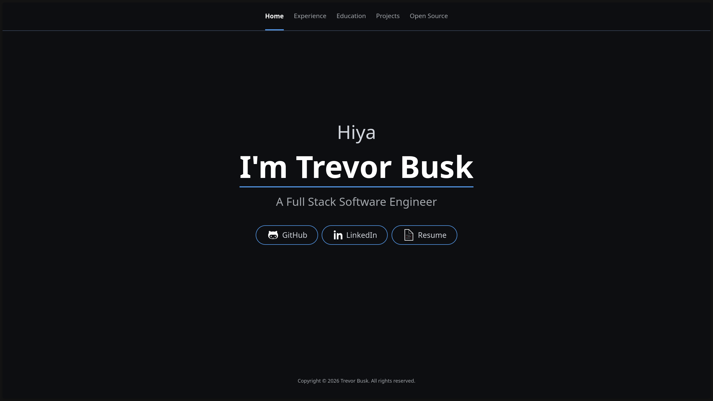
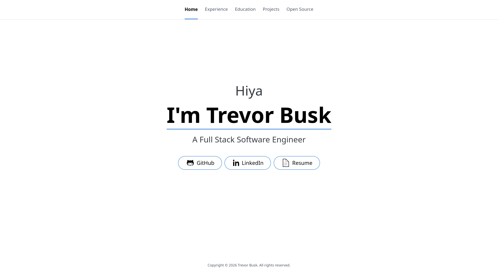

# Portfolio

This repository contains my portfolio, showcasing my software development journey.

It also is a template you can use to create your own portfolio.

## Live Site

[tbusk.com](https://tbusk.com)

### Preview

## Getting Started

### Prerequisites

- Node.js >= 20.19+ or 22.12+

> [!NOTE]
> 
> This version requirement comes from Vite 7 specifically

### Installation

1. Clone the repository
2. Install dependencies: `npm install`
3. Start the dev server: `npm run dev`

### Customization

Update the content in the json files in `src/data` with your own information

## Deployment

This web app is deployed to GitHub Pages automatically via GitHub Actions.

## Tech Stack

- **HTML/CSS**
- **TypeScript**
- **Vite**
- **Tailwind CSS**
- **Wouter**
- **Preact**
- **Swiper**

## License

This project is licensed under the [MIT License](./LICENSE)